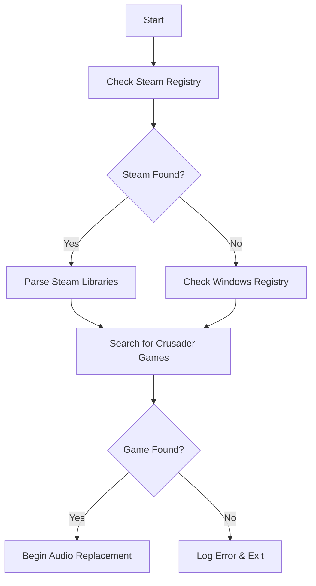

# 🎵 OG Crusader Sounds

<div align="center">


*Bringing back the classic Stronghold Crusader audio experience to Definitive Edition*

[Features](#-features) • [Installation](#-installation) • [Usage](#-usage) • [Troubleshooting](#-troubleshooting) • [Contributing](#-contributing)

**🔗 [View on GitHub](https://github.com/T3CC4/OGSounds)**

</div>

---

## 📋 Overview

**OG Crusader Sounds** is a BepInEx mod for **Stronghold Crusader Definitive Edition** that automatically replaces the game's audio with the beloved classic sound effects from the original **Stronghold Crusader** series.

> **Why this mod?** Many players prefer the original audio design of classic Stronghold Crusader. This mod seamlessly brings those sounds to the Definitive Edition while maintaining full game compatibility.

## ✨ Features

- 🔍 **Auto-Detection**: Automatically finds your Stronghold Crusader installation via Steam or Windows Registry
- 🧠 **Smart Replacement**: Uses MD5 hash comparison to only replace files that actually differ
- 🎓 **Tutorial Skip**: Automatically excludes tutorial audio files to preserve learning experience
- 📊 **Detailed Logging**: Comprehensive operation logs for transparency and debugging
- 🗂️ **Multi-Library Support**: Works with multiple Steam library locations
- ⚡ **Zero Configuration**: Works out of the box with no setup required

## 🎯 Requirements

| Component | Version | Notes |
|-----------|---------|-------|
| **Stronghold Crusader Definitive Edition** | Any | Target game |
| **BepInEx** | 5.4.x+ | [Download here](https://github.com/BepInEx/BepInEx/releases) |
| **Source Game** | Any variant | See [supported games](#supported-source-games) |

### Supported Source Games
- Stronghold Crusader (Original)
- Stronghold Crusader Extreme
- Stronghold Crusader HD

## 🚀 Installation

### Step 1: Install BepInEx
1. Download [BepInEx 5.4.x](https://github.com/BepInEx/BepInEx/releases) for your platform
2. Extract to your Stronghold Crusader Definitive Edition directory
3. Run the game once to generate BepInEx folders

### Step 2: Install the Mod
1. Download the latest `SCDEOGSounds.dll` from [Releases](https://github.com/T3CC4/OGSounds/releases)
2. Place it in `<Game Directory>/BepInEx/plugins/`
3. Launch the game

```
📁 Stronghold Crusader Definitive Edition/
├── 📁 BepInEx/
│   ├── 📁 plugins/
│   │   └── 📄 SCDEOGSounds.dll  ← Place here
│   └── 📁 config/
└── 🎮 Stronghold Crusader Definitive Edition.exe
```

## 🎮 Usage

The mod works automatically! Simply launch Stronghold Crusader Definitive Edition and the mod will:

1. **🔍 Detect** your original Stronghold Crusader installation
2. **📁 Locate** the `fx` folder containing audio files
3. **🔄 Replace** matching audio files in Definitive Edition
4. **📝 Log** all operations to BepInEx console/logs

### Example Log Output
```
[Info: OG Crusader Sounds] Found 247 files in source directory
[Info: OG Crusader Sounds] Skipped tutorial file: tutorial_welcome.wav
[Info: OG Crusader Sounds] Replaced: sword_clash.ogg
[Info: OG Crusader Sounds] Already replaced: arrow_hit.wav
[Info: OG Crusader Sounds] Summary: 156 replaced, 23 skipped, 68 not found
```

## 🔧 Technical Details

### Detection Method
The mod uses a multi-step detection process:



### File Matching
- Files are matched by **exact filename** regardless of folder structure
- **MD5 hashing** prevents unnecessary file operations
- **Tutorial files** are automatically excluded using filename pattern matching

## 🛠️ Troubleshooting

<details>
<summary><strong>❌ "Stronghold Crusader not found"</strong></summary>

**Possible Causes:**
- Original Stronghold Crusader is not installed
- Game is installed in non-standard location
- Registry entries are missing

**Solutions:**
- Ensure you have Stronghold Crusader/Extreme installed
- Try reinstalling the original game
- Check if the game appears in Steam library
</details>

<details>
<summary><strong>❌ "Required directories not found"</strong></summary>

**Possible Causes:**
- Missing `fx` folder in original game
- Permissions issues
- Corrupted installation

**Solutions:**
- Verify integrity of original game files
- Check folder permissions
- Reinstall original Stronghold Crusader
</details>

<details>
<summary><strong>❌ No audio changes heard</strong></summary>

**Possible Causes:**
- Files are identical (already replaced)
- Audio caching by game engine
- Mod not loading properly

**Solutions:**
- Check BepInEx logs for mod loading confirmation
- Restart the game completely
- Verify mod is in correct `plugins` folder
</details>

## 👨‍💻 Development

### Building from Source

```bash
git clone https://github.com/T3CC4/OGSounds.git
cd OGSounds
# Open in Visual Studio and build
# Reference: BepInEx.Core.dll, UnityEngine.CoreModule.dll
```

### Project Structure
```
📁 Source/
├── 📄 OGSounds.cs           # Main plugin class
├── 📄 SCDEOGSounds.csproj   # Project file
└── 📄 packages.config      # NuGet dependencies
```

## 🤝 Contributing

Contributions are welcome! Here's how you can help:

- 🐛 **Report Bugs**: Open an issue with detailed reproduction steps
- 💡 **Suggest Features**: Share your ideas for improvements
- 🔧 **Submit PRs**: Fork, create feature branch, submit pull request
- 📚 **Improve Docs**: Help make documentation clearer

### Contribution Guidelines
1. Follow existing code style
2. Add appropriate logging for new features
3. Test with multiple Stronghold Crusader variants
4. Update documentation as needed

## 📄 License

This project is licensed under the **MIT License**.

```
MIT License

Copyright (c) 2025 Tecca

Permission is hereby granted, free of charge, to any person obtaining a copy
of this software and associated documentation files (the "Software"), to deal
in the Software without restriction, including without limitation the rights
to use, copy, modify, merge, publish, distribute, sublicense, and/or sell
copies of the Software, and to permit persons to whom the Software is
furnished to do so, subject to the following conditions:

The above copyright notice and this permission notice shall be included in all
copies or substantial portions of the Software.
```

<details>
<summary>View full license</summary>

THE SOFTWARE IS PROVIDED "AS IS", WITHOUT WARRANTY OF ANY KIND, EXPRESS OR
IMPLIED, INCLUDING BUT NOT LIMITED TO THE WARRANTIES OF MERCHANTABILITY,
FITNESS FOR A PARTICULAR PURPOSE AND NONINFRINGEMENT. IN NO EVENT SHALL THE
AUTHORS OR COPYRIGHT HOLDERS BE LIABLE FOR ANY CLAIM, DAMAGES OR OTHER
LIABILITY, WHETHER IN AN ACTION OF CONTRACT, TORT OR OTHERWISE, ARISING FROM,
OUT OF OR IN CONNECTION WITH THE SOFTWARE OR THE USE OR OTHER DEALINGS IN THE
SOFTWARE.
</details>

---

<div align="center">

**Made with ❤️ by [Tecca](https://github.com/T3CC4)**

⭐ **Star this repo if it helped you!** ⭐

*This mod is not affiliated with or endorsed by Firefly Studios.*

[🔝 Back to Top](#-og-crusader-sounds)

</div>
